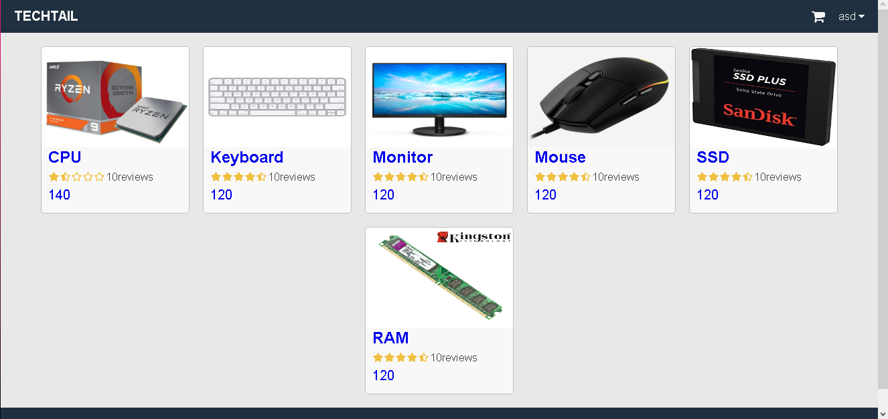
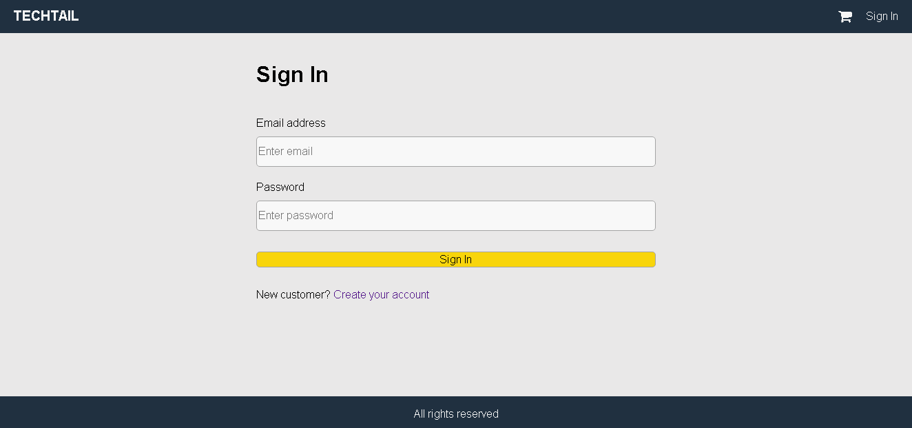
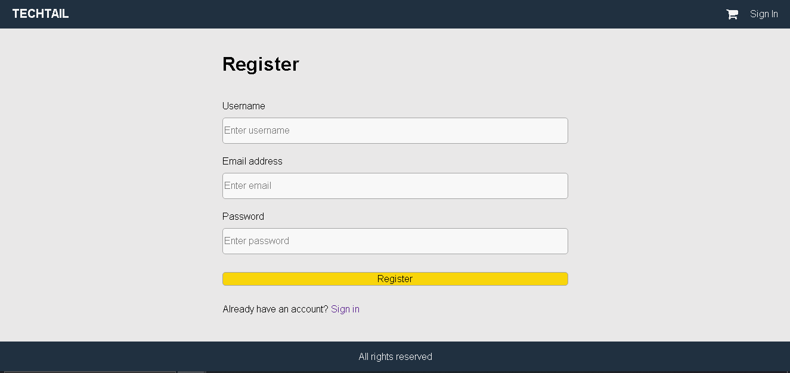
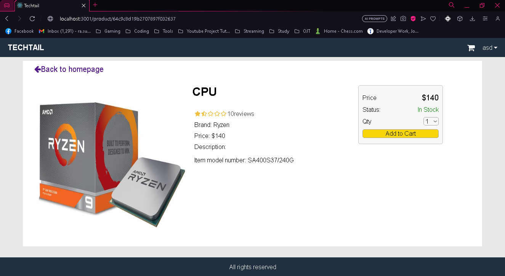
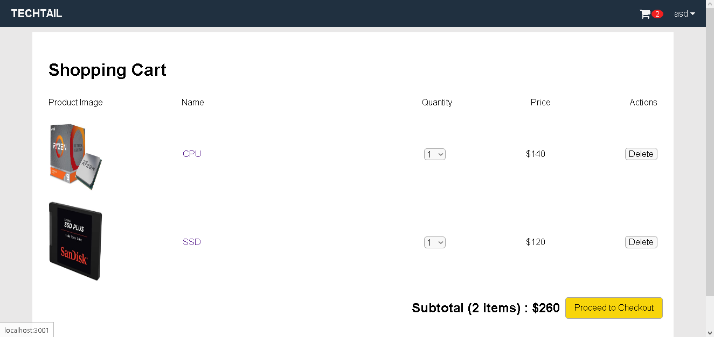

# Simple E-commerce Website
A simple e-commerce website using MERN stack from one of my college courses 



## Functionality

### Sign In Screen


### Register Screen


### Item Screen


### Cart Screen


## Getting Started
1. Clone the repo
2. Go to the directory and enter this in the terminal:

```
npm run start
```

 This will start the server at the localhost

3. After that, open a new terminal and install the dependecies using these commands:

```
cd frontend

npm install
```

4. To serve the frontend of the website, run:

```
npm start
```

Note: This project requires a MongoDB server installed

